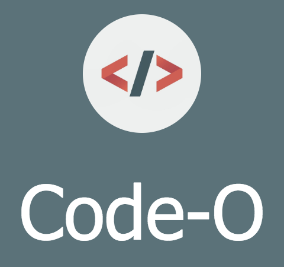
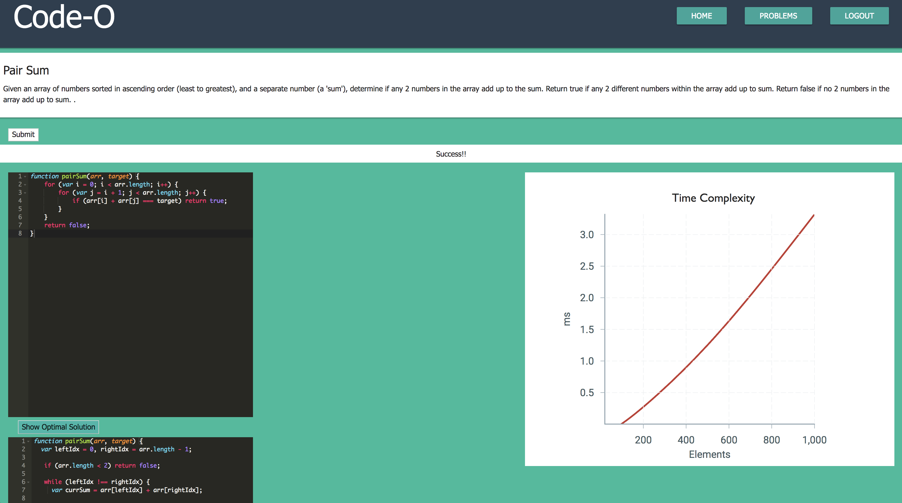

# Code-O 



## Introduction

Code-O is a coding platform where you can perform coding challenges and test the time complexity of your code. It is built using Node/Express, Sequelize, and Docker on the Back-end and React, Redux, and Victory (data visualization) on the Front-End. The user's input code is evaluated inside a Docker container for security purposes. The data is inputted into Victory to create a nice visualization of the data. Click the "Show Optimal Solution" button to see how your solution compares to the most optimal solution.

Visit us at: http://code-o.herokuapp.com/

## Team Members

- Abdul Ghaffar (https://github.com/aghaffar570)
- Plamen Dzhelepov (https://github.com/plamengj)
- Thanh Lai (https://github.com/Thanh-Lai)
- Noah Wu (https://github.com/DonghaoWu)

## Technologies

- Node/Express: Server
- React: Frontend Framework
- Postgres & Sequelize: Database & ORM
- Redux: State Management
- Docker: Container to Evaluate code
- Victory: Data Visualization

## Running

- npm install
```sh
$ npm install
```
- npm run start-dev: this runs on local host 8080
```sh
$ npm run start-dev
```

## Screenshot


